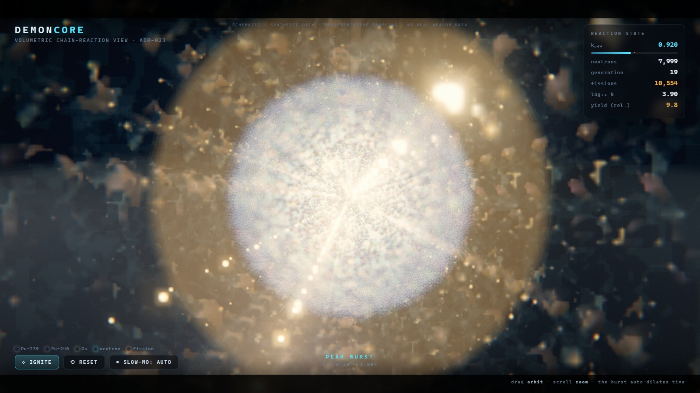
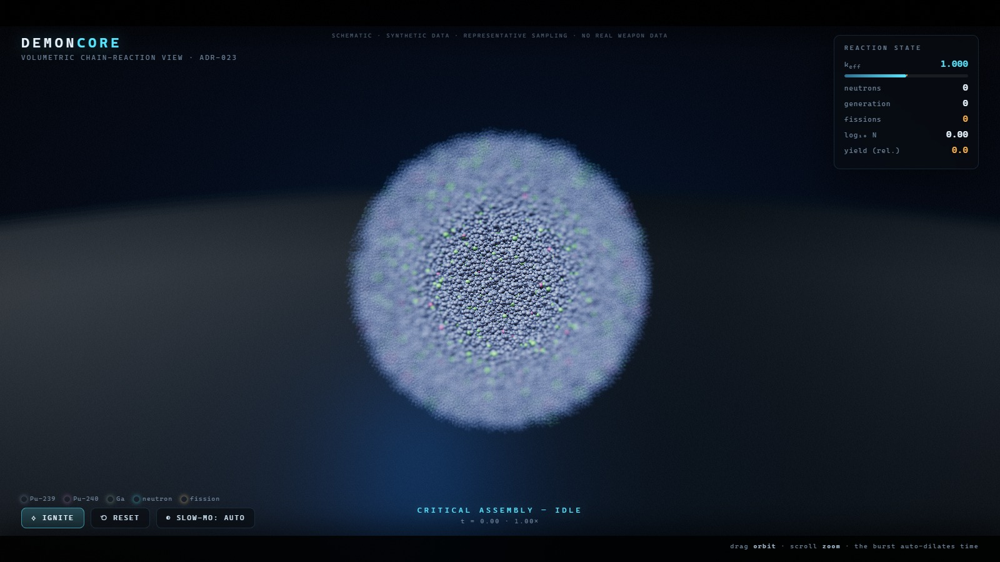
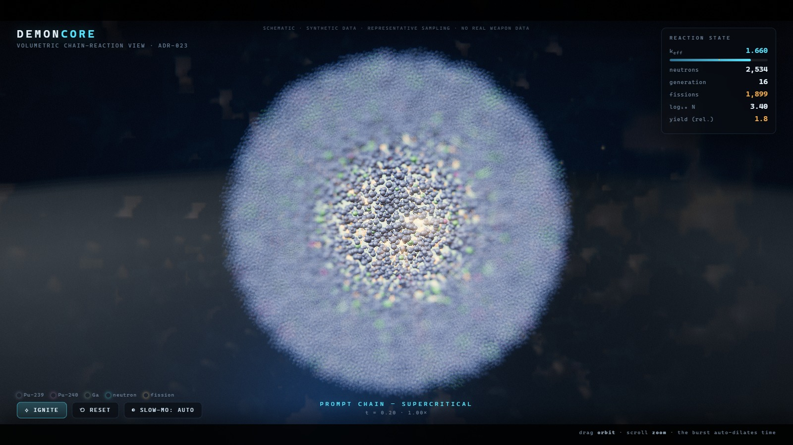
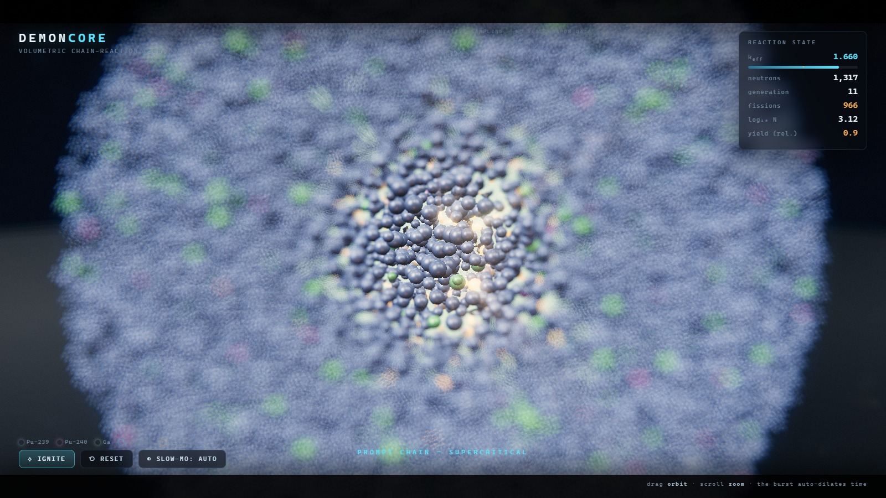
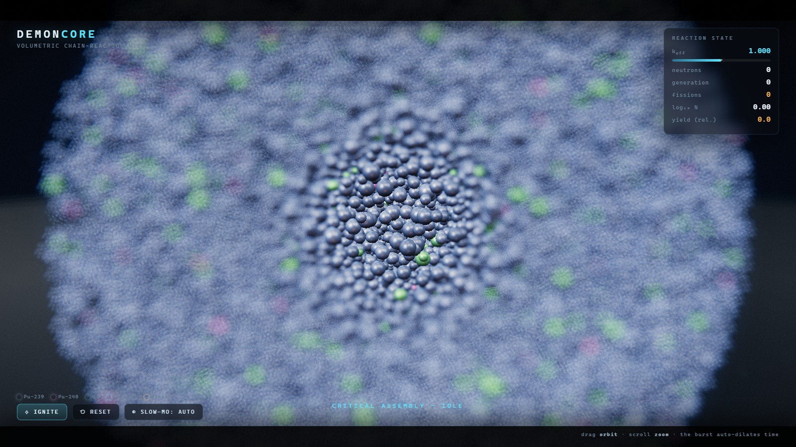
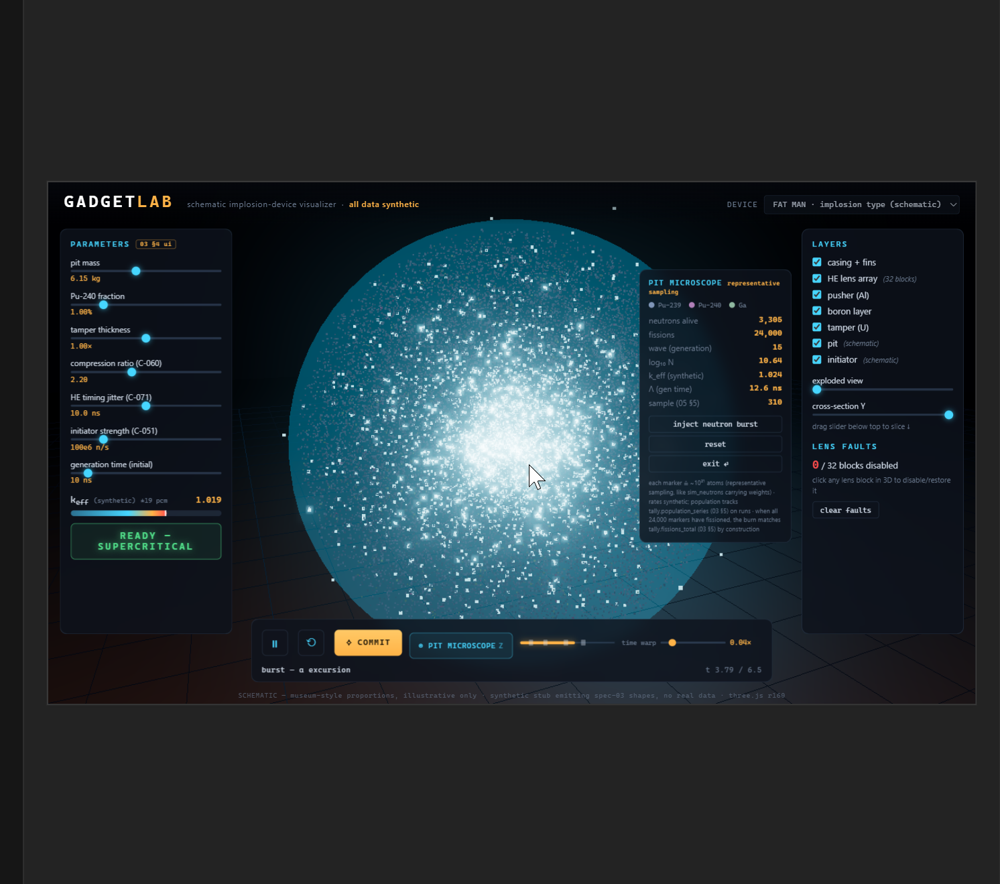
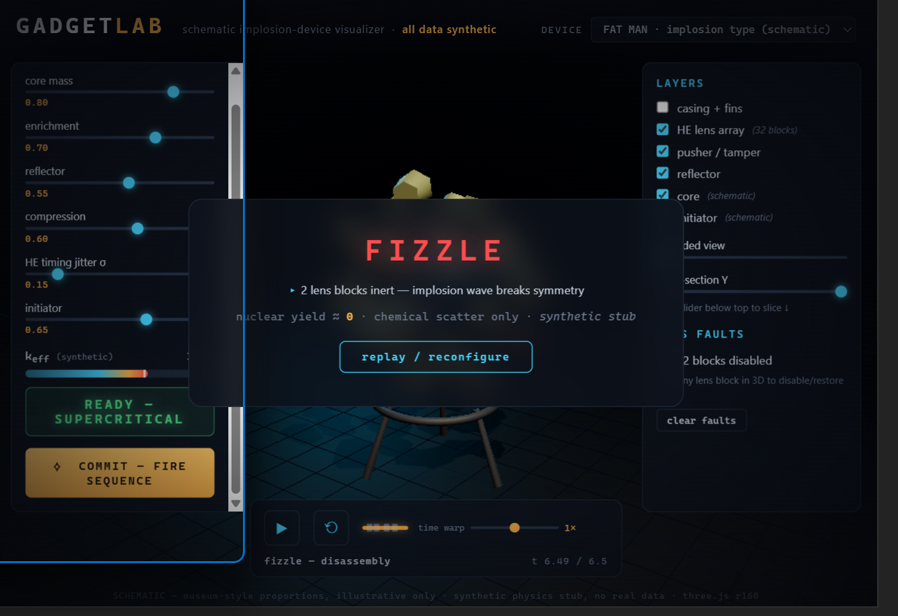

# NUCLEAR-SIM — visualization gallery

Two visual layers live here: the **demon-core chain-reaction view** (`core-view`, the
ADR-023 "main course") and the earlier **GadgetLab** schematic device sketch. Both are
**schematic, synthetic-data** front-ends — museum-style / illustrative framing from public
educational sources, **no real weapon data** (consistent with [`NOTICE.md`](../../NOTICE.md)
and `00-overview.md §2–§3`). The physics readouts shown are the modules' own
synthetic-but-spec-shaped stubs, not yet the `nscore` Monte-Carlo engine; the fusion seam
(`samples[].sites[]`) is real and proven, the data-swap is the pending work.

---

## The demon-core chain-reaction view — `core-view`

The cinematic, self-contained WebGL module [`viz/core-view.html`](../../viz/core-view.html)
([ADR-023](../../spec/DECISIONS.md)): **true-3D `InstancedMesh`** nuclei and neutrons (never
sprites), ACES tone-mapping, bloom, rack-focus depth-of-field, god-rays and a filmic grade
pass, with time auto-dilating through the burst. 24,000 representative nuclei stand in for
the pit's ~1.5×10²⁵ atoms. Frames captured **headless** from the module itself (its
`window.__cv` pose/step hook, driven by Puppeteer + system Chrome). The look targets a
hyperreal Unreal-Engine / *Modern Warfare*-class register and is still being pushed further
on the viz track.

### Peak burst
The prompt chain at maximum — a white-hot core erupting through the volumetric cascade,
god-rays and bloom carrying the excursion. HUD: k rolling back through 1.0 as disassembly
begins, ~8,000 neutrons alive, >10,000 cumulative fissions.

### Critical assembly — idle
The cold, assembled pit before initiation: 24,000 true-3D nuclei (Pu-239 blue-grey, Pu-240
magenta, Ga green) held in the rack-focus depth field, k = 1.000.

### Prompt chain — supercritical
Mid-cascade: the core igniting gold at the centre, neutrons streaking outward and blooming
into cinematic bokeh, k ≈ 1.66.

### Volumetric detail
Zoomed inside the pit — the individual instanced 3D sphere-nuclei (genuine geometry, not
points or sprites), a fission flash lighting its neighbours.

---

## GadgetLab — the schematic device view (earlier sketch)

**GadgetLab** is the earlier in-browser (Three.js) visualization layer — a quick
proof-of-concept for the interactive **device** view. The source is in [`viz/`](../../viz/)
(`index.html`; run it: `cd viz && python -m http.server 8099`). It is **not** wired to the
simulation core; its `k_eff` / yield readouts are the app's own **synthetic stub**.

> **All data synthetic · schematic only.** Every geometry and number here is museum-style /
> illustrative, from public educational framing — **no real weapon data**.

### The headline — pit microscope (the fission chain reaction)
Zoom into the plutonium pit during the α-mode excursion: a bundled volumetric cloud of
representative fission events (each marker ≈ 10²¹ atoms), with live readouts. The preview of
the "main course" now realized in `core-view` above; the real `nscore` engine already
streams the underlying per-generation fission **sites** (`ref::FissionSource::sites`) and the
temporal `population_series` (03 §5).

### Armed idle — assembled device
The assembled Fat-Man-type implosion device (casing + tail fins) on its stand; parameter
panel (core mass, enrichment, reflector, compression, HE timing jitter, initiator), synthetic
`k_eff` readout, and the READY / COMMIT–FIRE controls.

### Exploded 32-lens HE array
Casing and pusher/tamper toggled off, exploded-view slider raised: the truncated-icosahedron
**32-block HE lens array** (20 hex + 12 pent) around the core/initiator. Individual lens
blocks are clickable (the "lens faults" panel disables/restores them).

### Supercritical excursion
Mid-sequence after COMMIT–FIRE: the schematic core glows through the "supercritical excursion"
phase on the staged timeline (time-warp slider slows to ~0.02×).

### Detonation (synthetic)
End of the sequence: the fireball flash and the DETONATION summary card — *"convergent
compression achieved — runaway excursion · estimated yield 20.1 kt · synthetic stub — not a
real calculation."*

### Fizzle (synthetic)
The other emergent outcome — asymmetric implosion (lens blocks disabled) breaks the
compression wave: *"2 lens blocks inert — implosion wave breaks symmetry · nuclear yield ≈ 0."*
In the real engine, detonate-vs-fizzle is not a scripted branch; it **emerges** from whether
the core goes prompt-supercritical and then self-quenches (`generate_run`, M3-T3-h).

---

*Layers: [`viz/core-view.html`](../../viz/core-view.html) (the cinematic core view) and
[`viz/index.html`](../../viz/index.html) (GadgetLab) — Three.js r160 + a synthetic
`simstub.js`. Rendered proportions and physics are schematic placeholders pending the
fusion with the `nscore` engine.*
