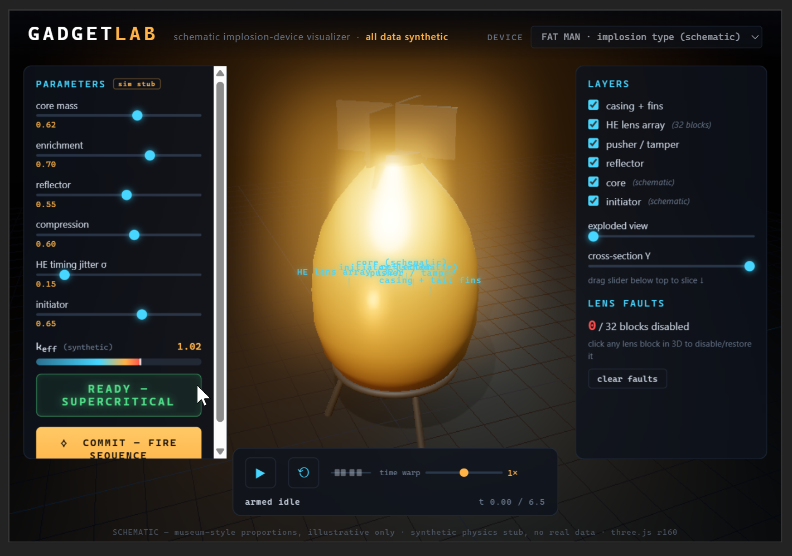
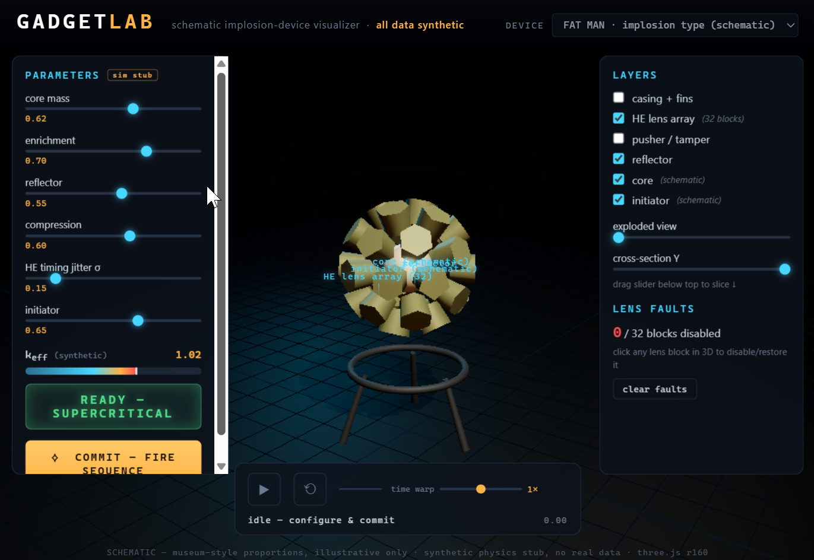
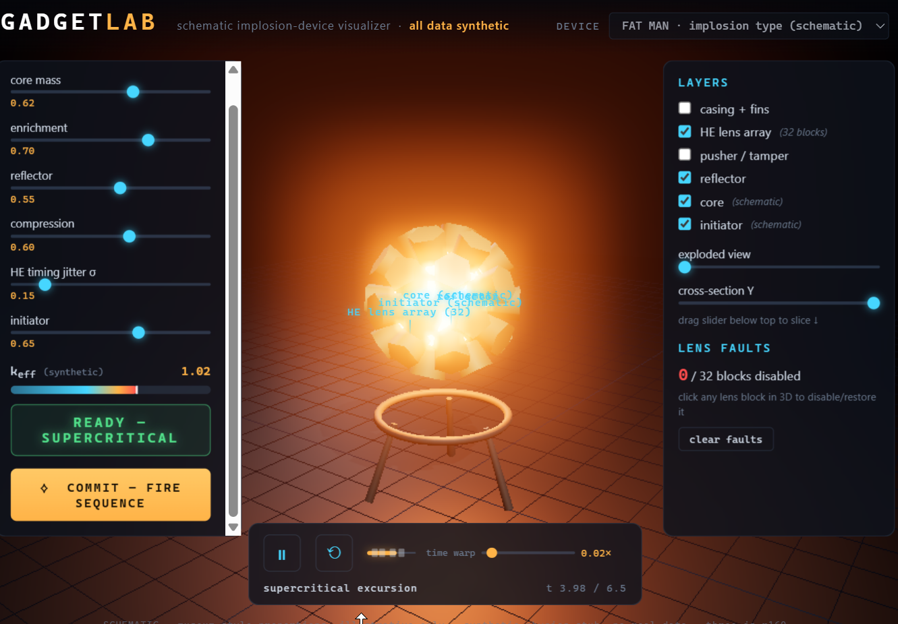
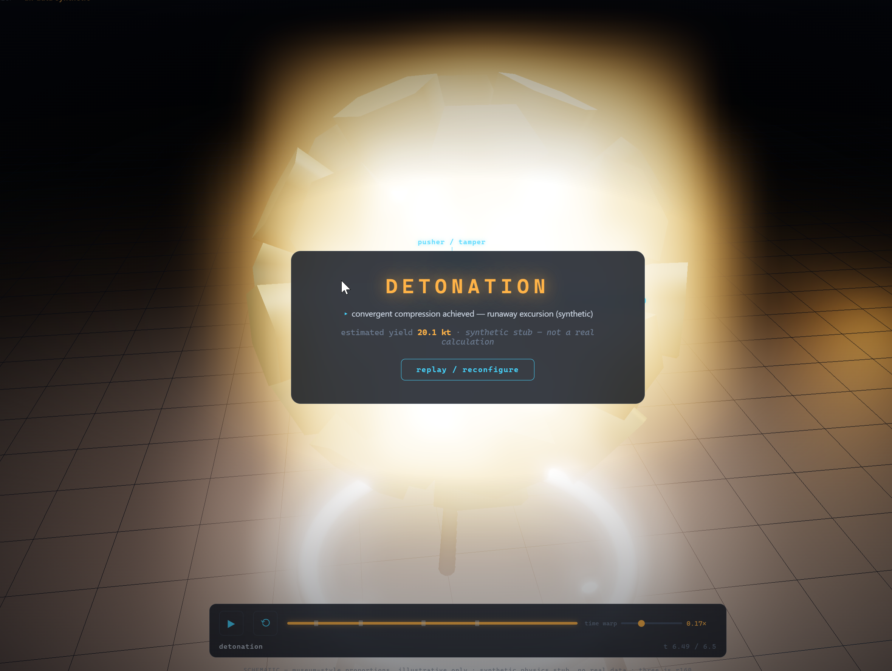

# GadgetLab — visualization gallery

Screenshots of **GadgetLab**, the schematic browser (Three.js) visualization layer
for NUCLEAR-SIM, developed in parallel at `C:\nukeviz`. This is an **early
mock-up / sketch** — a quick in-browser proof-of-concept for the interactive
device view. It is **not yet wired to the simulation core**; the physics readouts
shown (`k_eff`, yield) are the app's own **synthetic stub**, not the `nscore`
Monte-Carlo engine.

> **All data synthetic · schematic only.** Every geometry and number here is
> museum-style / illustrative, from public educational framing — **no real weapon
> data**, consistent with `NOTICE.md` and `00-overview.md §2–§3`. The device is
> rendered at schematic proportions; the "physics" is a placeholder curve. If the
> project later moves to an Unreal Engine renderer, this browser sketch remains a
> useful low-friction mock-up.

## Views

### Armed idle — assembled device
The assembled Fat-Man-type implosion device (casing + tail fins) on its stand;
parameter panel (core mass, enrichment, reflector, compression, HE timing jitter,
initiator), synthetic `k_eff` readout, and the READY / COMMIT–FIRE controls.

### Exploded 32-lens HE array
Casing and pusher/tamper toggled off, exploded-view slider raised: the
truncated-icosahedron **32-block HE lens array** (20 hex + 12 pent) around the
core/initiator. Individual lens blocks are clickable (the "lens faults" panel
disables/restores them).

### Supercritical excursion
Mid-sequence after COMMIT–FIRE: the schematic core glows through the
"supercritical excursion" phase on the staged timeline (time-warp slider slows to
~0.02×).

### Detonation (synthetic)
End of the sequence: the fireball flash and the DETONATION summary card —
*"estimated yield 12.8 kt · synthetic stub — not a real calculation."*

---

*Layer: `C:\nukeviz` — `index.html` + Three.js r160 + a synthetic `simstub.js`.
Rendered proportions and physics are schematic placeholders pending integration
with the `nscore` engine.*
